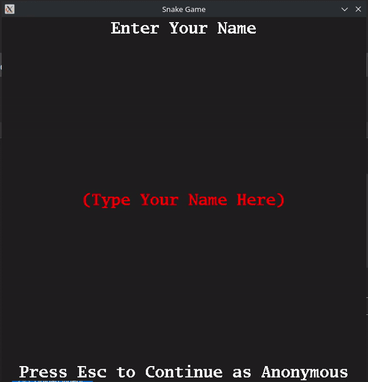

# CPPND: Capstone Snake Game 

This is a repo for the Capstone project in the [Udacity C++ Nanodegree Program](https://www.udacity.com/course/c-plus-plus-nanodegree--nd213). The code for this repo was inspired by [this](https://codereview.stackexchange.com/questions/212296/snake-game-in-c-with-sdl) excellent StackOverflow post and set of responses.

## Dependencies for Running Locally
* cmake >= 3.7
  * All OSes: [click here for installation instructions](https://cmake.org/install/)
* make >= 4.1 (Linux, Mac), 3.81 (Windows)
  * Linux: make is installed by default on most Linux distros
  * Mac: [install Xcode command line tools to get make](https://developer.apple.com/xcode/features/)
  * Windows: [Click here for installation instructions](http://gnuwin32.sourceforge.net/packages/make.htm)
* SDL2 >= 2.0
  * All installation instructions can be found [here](https://wiki.libsdl.org/Installation)
  >Note that for Linux, an `apt` or `apt-get` installation is preferred to building from source.

  > Linux command - $ apt-get install libsdl2-dev
* SDL2_ttf
  * All installation instructions can be found [here](https://lazyfoo.net/tutorials/SDL/06_extension_libraries_and_loading_other_image_formats/index.php)
  > Linux command - $ apt-get install libsdl2-ttf-dev 
* gcc/g++ >= 5.4
  * Linux: gcc / g++ is installed by default on most Linux distros
  * Mac: same deal as make - [install Xcode command line tools](https://developer.apple.com/xcode/features/)
  * Windows: recommend using [MinGW](http://www.mingw.org/)

## Basic Build Instructions

1. Clone this repo.
2. Make a build directory in the top level directory: `mkdir build && cd build`
3. Compile: `cmake .. && make`
4. Run it: `./SnakeGame`.

## Porject Rubrics
### Loops, Functions, I/O
1. Multiple control structures are added throughout the program (eg. game.cpp Game::Update() function.)
2. The project reads/writes top scores in data/high_score.txt file in scoreManager class.
    * scoreManager.cpp
      * line:43 read from score file
      * line:97 write into score file.
3. User inputs are accepted through in-game input screens.
    * controller.cpp 
      * line:112 HandleTextInput function reads player name using SDL_TextInput.
### Object Oriented Programming
1. Multiple new classes are added(Food, Menu, ScoreManager, Timer).
2. Classes Food, Game, Renderer use member initialization lists.
3. Render function is overloaded in class Renderer to render Menu or Game as per the game state.
    * renderer.h
      * line:44 Render function to render snake, food.
      * line:45 Render function to render menu.
4. Parent class Menu is inherited by different types of Menu classes(StartMenu, EndMenu, PauseMenu, HighScoreMenu etc), with each child Menu class overriding the parent class virtual function "Action".
    * menu.h, menu.cpp
### Memory Management
1. The project uses scope / Resource Acquisition Is Initialization (RAII) in following places:
    * game.cpp
      * line:92 In Game::Action function each menu stack pop operation ensures proper deallocation of resources as menu options are created using shared pointer.
      * line:154, line:162 In Game::PlaceFood function swap operation is used to create new food item which releases old food object pointed by the shared pointer.
2. Move semantic is used to move player name to game object from controller once user presses enter or escape key.
    * controller.cpp
      * line:148 player_name string variable local to Controller::Start function is moved to game object once the player confirms name input by pressing "enter".
3. Smart pointer is used in most places instead of raw pointer to ensure proper memory management.
    * main.cpp
      * line:21 A shared pointer of Game class is created inside main, which is used to pass around inside Renderer and Controller.
    * game.h
      * line:57 menu stack holds shared pointers of class Menu to ensure proper allocation and deallocation of resources without hardcoding new/delete operations.

### Concurrency
1. Multithreading is used to run Input control, Game, Render features in seperate threads. 
    * main.cpp
      * line:22 game thread
      * line:25 controller thread
      * renderer is run inside main thread
2. Mutex and locks are used to enable to protect consistent shared data access.
    * controller.cpp
      * line:16 Ensures snake direction is not changed multiple time without snake head moving to a new location.
    * renderer.cpp
      * line:73 (lock_guard) Ensures Menu is not changed between reading and rendering the same.
      * line:156 (unique_lock) Ensures Foods are not changed between reading and rendering.
      * line:171 (unique_lock) Ensures Snake is not changed beween reading and rendering.
    * game.cpp
      * line:57 (unique_lock) Ensures game update waits on user selection of menu option, used for cv_game condition variable.
      * line:65 (unique_lock) Ensures game update waits on user name input confirmation, used for cv_game condition variable.
      * line:100 (unique_lock) Locks snake mutex to ensure no access to snake while snake is being updated to ensure consistent access, is subsequently unlocked after snake is updated.
      * line:120 (lock_guard) Ensures food is not access while being updated.
      * line:185 In MenuAction function, menu updates combined with game state changes are protected with lock_guards.
3. Condition variables are used to synchronize user input and game actions.
    * controller.cpp
      * line:17 snake cv_update condition variable waits on change of snake head position on the grid after changing the direction as per user input.
    * game.cpp
      * line:58 game thread waits on user to select a menu option to perform next action.
      * line:66 game thread waits on user to confirm name input before performing next action.

## Added Game Features
1. At the start of the game user is asked to input their name which is used to store high scores.
2. Different Menus are added to navigate through game.
3. Two additional types of foods are added called SuperFood:
    * Big Food: 
      * It is double in width and height, and is green in color.
      * Score is increased by 2 if the snake its it.
      * Once presented the player have 10 seconds to eat the food before it disappers.
      * It has 5/100 chances of appearing in the game.
    * Magic Food:
      * It is similar to a normal food in width and height, and is blue in color.
      * It enables the snake to cross itself for the next 10 seconds once eaten.
      * It has 5/100 chances of appearing in the game.
4. During game play current score, high score and frame per second are displayed.
5. Additionally if there is a super food present then a timer until it disappers will be shown. Same for the snake if the snake has eaten a magic food then there will be timer until it returns to normal.

## CC Attribution-ShareAlike 4.0 International

Shield: [![CC BY-SA 4.0][cc-by-sa-shield]][cc-by-sa]

This work is licensed under a
[Creative Commons Attribution-ShareAlike 4.0 International License][cc-by-sa].

[![CC BY-SA 4.0][cc-by-sa-image]][cc-by-sa]

[cc-by-sa]: http://creativecommons.org/licenses/by-sa/4.0/
[cc-by-sa-image]: https://licensebuttons.net/l/by-sa/4.0/88x31.png
[cc-by-sa-shield]: https://img.shields.io/badge/License-CC%20BY--SA%204.0-lightgrey.svg
